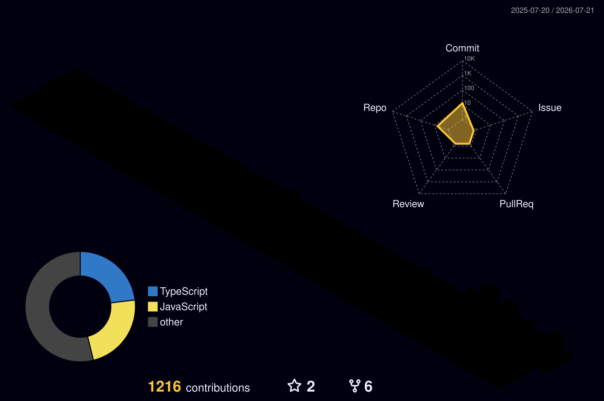

  
  

  

  
  
  
  

---

## About

Senior Blockchain Engineer specializing in decentralized finance, real world asset tokenization, and enterprise Web3 solutions. Currently architecting **AfriChain** and **LandFi** to transform African markets through blockchain infrastructure.

- **Blockchain Architecture:** production grade smart contracts and DeFi protocols
- **Technical Leadership:** lead engineering teams and design scalable Web3 ecosystems
- **Full Stack Engineering:** end to end decentralized applications with modern stacks
- **Innovation:** blockchain solutions for emerging markets and real world use cases

---

## Current Projects

### AfriChain
Blockchain ecosystem for African real world asset tokenization, digital identity, and decentralized financial services.

`Solidity` `BSC` `Next.js` `TypeScript` `Hardhat`

### LandFi
Web3 marketplace tokenizing land titles, real estate, and property documentation with on chain verification.

`Solidity` `BSC` `React` `Web3.js` `IPFS`

---

## Tech Stack

**Blockchain and Web3**

**Full Stack**

---

## Repositories

  
  
  

> Public repositories represent a portion of my work. Extensive private client and enterprise projects available upon request.

---

## GitHub Analytics

  
  

  

  

### Contribution Calendar in 3D

  

---

## Certifications

- **2025** Solana Developer Certification
- **2024** BNB Chain Developer Certification
- **2024** Advanced Blockchain Development, Seme City
- **2023** Master's Degree in Blockchain and Web3, Founderz

---

## Connect

Open to CTO roles, technical partnerships, blockchain consulting, and strategic collaborations.

